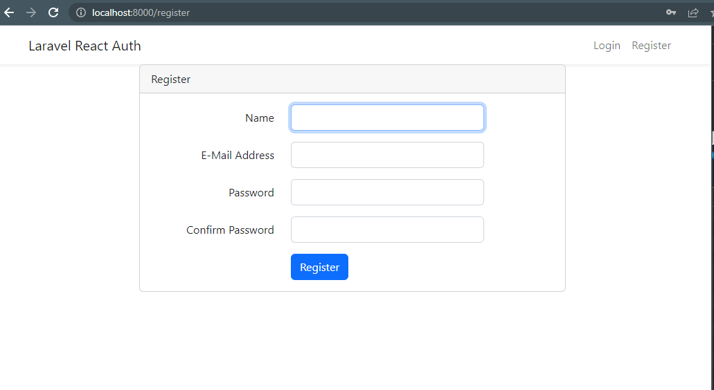
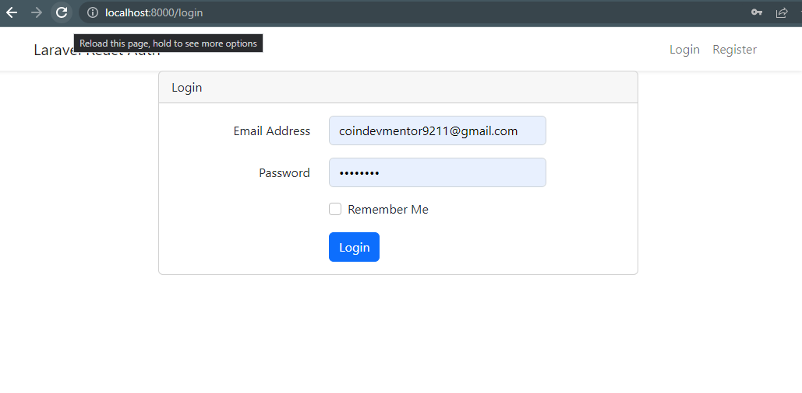
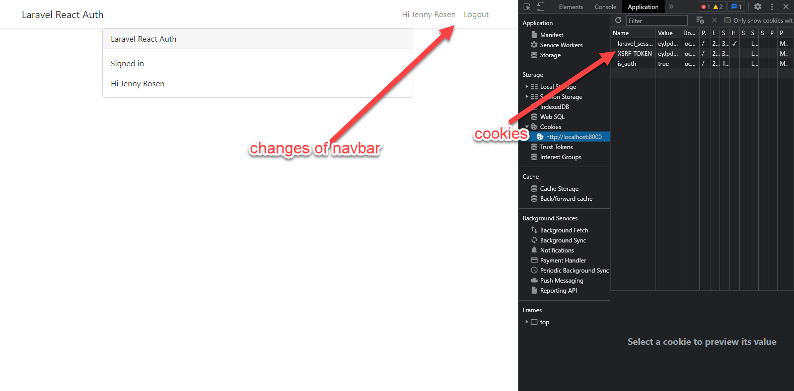

# LaravelReact

This is the web application that uses Laravel as backend and React as frontend. 
This project is very good if you want to combind Laravel and React. 
I suffered a lot for errors but eventually succeeded on this project. :)  

# How to use

In my experience, this help doesn't work with this above command. It is only right in theory.  
But this project works well, so I suggest to downland and run on your local computer this project.  
An error can occour if you follow the instructions for the confliction of Laravel version and React version.  
https://webmobtuts.com/frontend-development/laravel-sanctum-authentication-in-react-apps/

# How to run 

1. download the laravelreact.zip full source code.  
2. composer install  
3. npm install  
4. install xampp and create database as mentioned in .env file. (db name is "laravel")  
5. npm run dev  
6. php artisan serve  

# Running Screens

# How to combine Laravel and React. (Tutorial)

1. composer create-project laravel/laravel:8.x.x lara_react_auth --prefer-dist
2. composer require laravel/sanctum
3. php artisan vendor:publish --provider="Laravel\Sanctum\SanctumServiceProvider"
4. Next, make sure that the Sanctum middleware in the api middleware group in Kernel.php
   'api' => [
             \Laravel\Sanctum\Http\Middleware\EnsureFrontendRequestsAreStateful::class,     // sanctum middleware
            'throttle:api',
            \Illuminate\Routing\Middleware\SubstituteBindings::class,
        ],
5. Finally run the migrations to generate the user and sanctum related tables:
6. Sanctum Config
    'stateful' => explode(',', env('SANCTUM_STATEFUL_DOMAINS', sprintf(
        '%s%s',
        'localhost,localhost:3000,127.0.0.1,127.0.0.1:8000,::1',
        Sanctum::currentApplicationUrlWithPort()
    ))),
7. Installing React
  - composer require laravel/ui
  - php artisan ui react
  - npm install
  - npm install react-router-dom@6
  - npm run dev
  - php artisan serve
  - 
